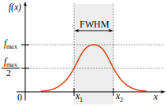

Arquitectura
============

**w0sa** está escrito en *python*. Este módulo comprende principalmente de 4 clases:

- ``W0SAShell(cmd.Cmd)``
- ``WSSimulator``
- ``OSAmulator``
- ``Calibration``

``W0SAShell(cmd.Cmd)`` simula la CLI de un WSS *finisar flexigrid*. Acá, se definen los comandos permitidos, y los métodos se encargan de *parsear* los argumentos de entrada y pasarlos como argumentos a los métodos de las demás clases. ``WSSimulator`` posee estructuras de datos y métodos para simular el funcionamiento de un WSS. Sus métodos modifican las estructuras de datos y por ende el estado del simulador. ``OSAmulator`` configura la visualización y muestra el espectro en la salida del WSS. ``Calibration`` es la clase encargada de realizar los ajustes necesarios sobre el espectro del WSS para obtener resultados similares a una respuesta real.

La resolución del simulador del WSS es 6.25 GHz (la mitad del ancho de banda de cada *slot*). De este modo, cada *slot* está representado por tres frecuencias correspondientes a la frecuencia central del *slot* y las dos frecuencias bordes (frecuencia central +- 6.25 GHz). Por lo tanto, la atenuación definida por ``URA`` para un determinado canal se aplica a las tres frecuencias de cada *slot* que conforman el canal.

Un OSA se compone principalmente de un *monocromador* y un *fotodetector*. El *monocromador* actúa como un filtro óptico sintonizable que selecciona un rango estrecho de longitudes de onda alrededor de una longitud de onda central. Por su parte, el *fotodetector* mide la potencia de la luz que pasa a través de este filtro. Al modificar la longitud de onda central del filtro, es posible realizar un barrido y obtener así un espectro en un rango extendido de longitudes de onda. La respuesta espectral de dicho filtro se aproxima comúnmente a la de un filtro *Gaussiano*. La **resolución del OSA** se especifica a partir del **ancho de banda efectivo del filtro a -3 dB**, también conocido como *Full Width at Half Maximum* (FWHM) (ver Figura de abajo). Esto significa que la resolución corresponde a la diferencia entre las longitudes de onda donde la respuesta del filtro cae a la mitad de su potencia máxima.

La función de transferencia *Gaussiana* se expresa como:

.. math::

   f(x) = \exp\left(-\frac{x^{2}}{2\sigma^{2}}\right)

Dado que la resolución del OSA se define como el ancho de banda entre los puntos que presentan una respuesta a -3 dB (la mitad de la potencia máxima), se obtiene:

.. math::

   \exp\left(-\frac{x^{2}}{2\sigma^{2}}\right) &= 0.5 \\
   -\frac{x^{2}}{2\sigma^{2}} &= \ln{0.5} \\
   \frac{x^{2}}{2\sigma^{2}} &= \ln{2} \\
   x^{2} &= 2\sigma^{2}\ln{2} \\
   x &= \pm \sigma \sqrt{2\ln{2}}

Por lo tanto, la relación entre FWHM (resolución OSA) y la desviación estándar del filtro es:

.. math::

   \mathrm{FWHM}
   = x_{right} - x_{left}
   = 2 \sigma \sqrt{2 \ln{2}}
   \approx 2.355 \sigma

Con lo anterior, se encuentra la desviación estándar como:

.. math::

   \sigma = \frac{\mathrm{FWHM}}{2.355}

Lo anterior se implementa en el método ``smoothing`` de la clase ``OSAmulator``, el cual aplica un filtro *Gaussiano* 1D para emular la resolución del OSA real.

Para la calibración de potencia, se define un *offset* base de ``5.0 dB`` dado por la diferencia de los espectros ``CWDM_r1.0_s50`` (extraido de un OSA real) y ``w0saCWDM_r1.0_s50`` (generado por ``w0sa`` utilizando la misma configuración). Cabe destacar que la entrada a ``w0sa`` es un espectro ``EDFA1000_r1.0_s50``. Con esto se determina un factor de calibración dado por:

.. math::

   \Delta_{cal} = base_{offset} - 10 \cdot \log\frac{res_{base}}{res_{in}} + 10 \cdot \log\frac{res_{base}}{res_{OSA}}

.. important::

   La resolución del espectro de entrada debe coincidir con la resolución de entrada en ``w0sa`` (resolución del espectro EDFA). Esto debe ser configurado manualmente por el usuario mediante el comando ``SINRES``.

.. important::

   Al realizar una comparación de resultados entre ``w0sa`` y un expectro extraido desde un OSA real, las resoluciones de salida deben ser identicas en ambos casos. Es decir, sería incorrecta una comparación entre ``CWDM_r1.0_s50`` y ``w0saCWDM_ri1.0_si50_ro0.5_so50`` debido a que la resolución de salida del espectro real es ``1.0 nm`` mientras la del espectro simulado es ``0.5 nm``. Una comparación correcta sería entre los espectros ``CWDM_r0.5_s50`` y ``w0saCWDM_ri1.0_si50_ro0.5_so50``. El script ``w0sa/data/comparator.py`` posee una función que facilita la comparación entre dos espectros.

.. autoclass:: w0sa.cli.shell..W0SAShell
   :members:
   :member-order: bysource

.. autoclass:: w0sa.core.wss_simulator.WSSimulator
   :members:
   :member-order: bysource

.. autoclass:: w0sa.core.osa_simulator..OSAmulator
   :members:
   :member-order: bysource

.. autoclass:: w0sa.calibration.calibration.Calibration
   :members:
   :member-order: bysource

